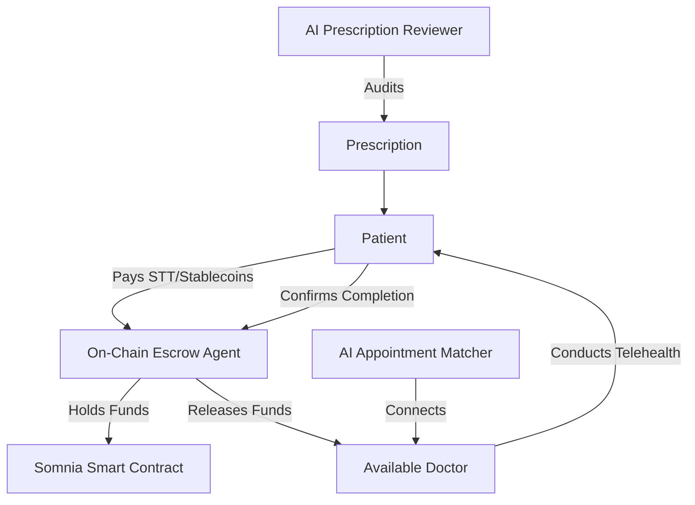

# Doctors on Wheels (docsonwheels.co.za) - Pitch Deck & Market Research

This document outlines the market research, strategic positioning, and pitch deck structure for **Doctors on Wheels (South Africa)**, a hybrid Web2/Web3 healthcare platform leveraging autonomous agents and the **Somnia Agentic L1** blockchain.

---

## 1. Executive Summary
Doctors on Wheels is a disruptive, AI-driven, and blockchain-secured healthcare platform tailored specifically for the South African market. By combining a "gig economy" model for medical professionals with on-chain escrow contracts and autonomous AI agents, Doctors on Wheels solves the twin challenges of healthcare access and trust. 

*   **Mission:** To democratize healthcare access in South Africa through secure, affordable, and instant virtual consultations.
*   **Core Innovation:** Hybrid Web2 convenience with Web3 security (Somnia L1) and AI-driven automation (Autonomous Agents).

---

## 2. The Problem
South Africa's healthcare system is deeply bifurcated, characterized by extreme disparities between the public and private sectors.

1.  **Doctor Shortage & Long Wait Times:** The public sector faces a severe shortage of medical practitioners, leading to hours-long queues for basic consultations.
2.  **Affordability & Cost Barriers:** Private healthcare is prohibitively expensive for the majority of South Africans, while medical aid schemes are out of reach for low-to-middle income earners.
3.  **Trust & Payment Friction:** Digital consultations suffer from high transaction trust friction. Patients fear paying upfront and not receiving quality care, while doctors fear non-payment or high platform transaction fees.
4.  **Administrative Overhead:** Traditional practices spend up to 30% of their revenue on administrative tasks, insurance claims, and appointment scheduling.

---

## 3. The Solution: Doctors on Wheels
A hybrid platform that bridges the physical-digital divide and uses cutting-edge technology to streamline healthcare delivery.

*   **Gig Economy for Doctors:** Doctors toggle "Gig Mode" to consult during spare hours, setting their own rates. This unlocks idle healthcare capacity.
*   **On-Chain Trust (Somnia L1 Escrow):** Payments are locked in a secure smart contract. Funds are only released to the doctor upon successful consultation, protecting both parties.
*   **Autonomous AI Agents:**
    *   *Appointment Matcher:* Automatically matches waiting patients with the most suitable, active doctor.
    *   *Prescription Reviewer:* Audits prescriptions in real-time for safety and drug interactions using LLM inference.
    *   *Follow-Up Scheduler:* Automates post-consultation care instructions and check-ins.

---

## 4. Market Size & Opportunity (South Africa)

*   **Total Addressable Market (TAM):** The South African healthcare market (public and private combined) is over **USD 15 billion** annually.
*   **Serviceable Addressable Market (SAM):** The South African digital health and telehealth market is valued at **USD 0.37 billion (2025)** and is projected to reach **USD 1.20 - 1.72 billion by 2033** (growing at a **CAGR of 12.7% - 21.13%**).
*   **Serviceable Obtainable Market (SOM):** Target 5% of the emerging middle-class and unbacked/underinsured demographic, representing a **USD 20 - 50 million** annual opportunity.

### Key Drivers in South Africa:
1.  **Internet & Mobile Penetration:** Over **72% (43 million users)** have internet access, primarily via smartphones.
2.  **National Health Insurance (NHI):** The government's push for NHI requires scalable, digital-first infrastructure to bridge public-private gaps.
3.  **Consumer Trust in Digital Payments:** High familiarity with digital wallets and instant EFTs, making the transition to Web3-backed micro-payments seamless.

---

## 5. Technology Stack
*   **Frontend:** Vanilla HTML5, CSS3, and JavaScript (highly optimized for low-bandwidth mobile browsers).
*   **Backend:** FastAPI (Python 3.10+) ensuring high throughput and low-latency API endpoints.
*   **Database:** Supabase Postgres (Production) / SQLite (Local dev).
*   **Blockchain Integration:** Somnia Agentic L1 (Testnet/Mainnet) for on-chain escrow contracts using Solidity.
*   **Real-time Communication:** Socket.io / WebSockets for seamless video and chat consultations.

---

## 6. Business Model & Monetization
Doctors on Wheels operates on a transparent, low-margin, high-volume model enabled by low transaction fees on Somnia L1.

1.  **Platform Service Fee:** A flat 10% commission on all completed consultations (significantly lower than the 20-30% charged by Web2 gig platforms).
2.  **Gas Fee Optimization:** By utilizing Somnia L1, transaction fees are negligible, enabling micro-consultations (e.g., R50 - R100 / $3 - $6).
3.  **SaaS for Clinics:** B2B subscription model for independent clinics to run their own custom telehealth queues and dispatch doctors using our autonomous matcher.

---

## 7. Competitive Landscape
| Feature | Doctors on Wheels | Traditional Telehealth (Web2) | Public Sector / Clinics |
| :--- | :--- | :--- | :--- |
| **Consultation Cost** | Low (Micro-payments & low fees) | High (Aimed at medical aid users) | Free (but massive time cost) |
| **Trust Mechanism** | On-chain Smart Escrow | Upfront credit card payment | None |
| **Matching Speed** | Instant (AI Agent Matcher) | Manual booking / long delays | 4 - 8 hours wait times |
| **Doctor Autonomy** | High (Instant gig toggle & payouts) | Low (Fixed contracts/salaries) | Low (Overworked) |
| **AI Safety Auditing** | Real-time AI Rx Audit | Manual / Doctor dependent | Manual / Doctor dependent |

---

## 8. Go-To-Market (GTM) Strategy
*   **Phase 1: Practitioner Acquisition (Supply):** Partner with junior doctors, registrars, and locums looking to supplement their income during off-duty hours.
*   **Phase 2: Community Outreach & Micro-campaigns (Demand):** Launch localized campaigns in peri-urban areas where physical clinics are crowded. Highlight the cheap, contract-free, pay-as-you-go pricing.
*   **Phase 3: Corporate Partnerships:** Partner with logistics/gig platforms (e.g., delivery drivers, ride-hailing drivers) to provide micro-consultation packages as an employee benefit.

---

## 9. Funding Ask & Milestones
We are seeking **USD 500,000** in seed funding to achieve the following milestones:
*   **Product Development (40%):** Launch on Somnia L1 Mainnet and complete mobile app packaging (PWA/Android).
*   **Regulatory & Compliance (20%):** Secure full HPCSA and POPIA (Protection of Personal Information Act) compliance certification.
*   **Marketing & Doctor Onboarding (30%):** Onboard 1,000 verified South African doctors and acquire 20,000 active patients.
*   **Operations (10%):** General administrative and legal expenses.

---
*Created and maintained by Antigravity AI Agent.*
